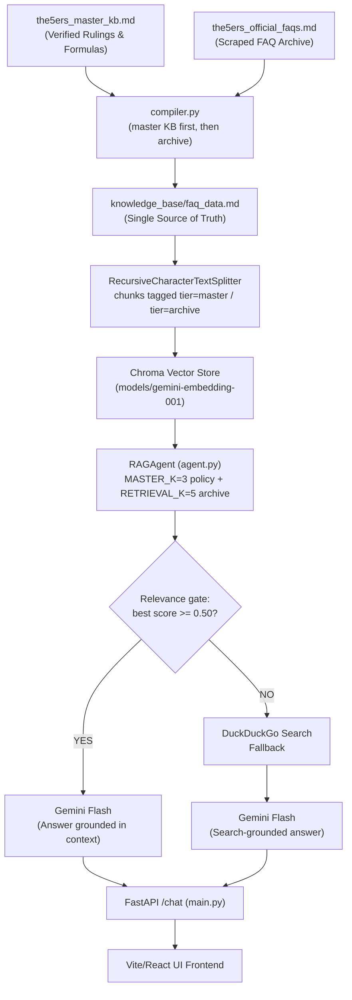

# System Architecture & Data Pipeline Guide: The5ers RAG Bot

## 1. Project Overview
This project is an automated AI Support Assistant and RAG (Retrieval-Augmented Generation) bot built specifically for **The5ers Proprietary Trading Firm**. It assists support agents and traders with precise, mathematically accurate, and policy-compliant answers regarding rules, drawdown calculations, consistency requirements, programs, commissions, and platform operations.

---

## 2. Directory Structure
```
5ers RAG bot/
├── backend/
│   ├── .env                    # Real secrets (GEMINI_API_KEY) - never commit
│   ├── .env.example            # Documented template of every setting
│   ├── agent.py                # LangChain RAG agent with ChromaDB & DuckDuckGo fallback
│   ├── compiler.py             # Builds knowledge_base/faq_data.md from the KB sources
│   ├── main.py                 # FastAPI server exposing /chat and /health
│   ├── scraper.py              # WordPress REST API crawler (212 English FAQs)
│   ├── smoke_test.py           # Ground-truth checks for retrieval, answers, fallback
│   └── chroma_db/              # Persisted vector store + kb_fingerprint.json
├── frontend/                   # React + Vite chat interface
│   ├── src/                    # UI components and API client
│   └── package.json
├── knowledge_base/             # Standardized knowledge base & context files
│   ├── architecture_and_pipeline.md  # This document
│   ├── faq_data.md             # COMPILED single source of truth (do not hand-edit)
│   ├── the5ers_master_kb.md    # Verified rules, formulas, and senior mod rulings
│   ├── the5ers_official_faqs.md# Official FAQ archive (212 articles, generated)
│   └── scraped/                # Raw crawler output, promoted by hand after review
└── requirements.txt            # Python dependencies
```

**Editing rule:** `faq_data.md` is generated. Edit `the5ers_master_kb.md` or
`the5ers_official_faqs.md`, then re-run `python backend/compiler.py`.

---

## 3. Data Flow & RAG Pipeline



### 3.1 Why chunks are tiered
Vector similarity ignores a chunk's position in the file, so writing the master KB
at the top of `faq_data.md` does **not** by itself make policy outrank marketing
text. The master KB is only 14 of 233 chunks (6%), so the 3,300-line archive won
essentially every query. `agent.py` therefore splits the compiled file at the
`# The5ers Official FAQ Archive (Reference Material)` heading, tags each chunk
`tier=master` or `tier=archive`, and retrieves from both tiers on every query with
verified policy placed first in the context window. The same rules are also
restated in `POLICY_PREAMBLE`, which is prepended to every prompt and explicitly
overrides conflicting retrieved text.

### 3.2 Routing: knowledge base or web
Whether a question is answered from the knowledge base or handed to DuckDuckGo is
decided by the **retrieval relevance score**, not by a second model call.
Measured against this knowledge base, in-domain questions score 0.59-0.66 and
out-of-domain ones 0.31-0.46, so `RELEVANCE_THRESHOLD` defaults to 0.50.

This replaced an LLM yes/no evaluator. That gate was non-deterministic — it
answered "no" to *Does the Bootcamp maximum loss trail my peak profits?* on some
runs despite the rule sitting in the master KB, sending a well-covered question
to web search and back with "I lack the necessary data". Scoring is deterministic,
adds no latency, and halves the generate requests per question, which matters a
great deal on the free tier.

### 3.3 Index lifecycle
The vector store is **not** rebuilt on every startup. `agent.py` writes a
`kb_fingerprint.json` (source hash + chunk config + embedding model + schema
version) into `chroma_db/`. On boot it reuses the persisted collection when the
fingerprint matches, and rebuilds from scratch — wiping the directory first, so
duplicate chunks cannot accumulate — when the knowledge base or chunking config
changes. A cold build takes ~2 minutes; a warm start takes ~1 second.

### 3.4 Rate limits
Free-tier Gemini quotas shape the design and are **per model, per day**:
* **Embeddings:** 100 requests/minute, and the client issues one request per chunk.
  Indexing is therefore batched (`EMBED_BATCH_SIZE`) and paced (`EMBED_BATCH_PAUSE`),
  with retries that honour the server's suggested backoff.
* **Generation:** one request per question, since routing is score-based rather than
  a second model call. `gemini-3.5-flash` allows only 20/day on the free tier, which
  is why the default is `gemini-3.5-flash-lite`. Change `CHAT_MODEL` in `.env` to
  move to a paid tier or a different model.

---

## 4. Running the Project

```bash
# 1. Install dependencies
pip install -r requirements.txt

# 2. Add your key
cp backend/.env.example backend/.env   # then set GEMINI_API_KEY

# 3. Build the knowledge base (writes knowledge_base/faq_data.md)
python backend/compiler.py

# 4. Start the API (first run embeds the KB, ~2 min)
cd backend && uvicorn main:app --reload --port 8000

# 5. Start the UI
cd frontend && npm install && npm run dev
```

Verify with `python backend/smoke_test.py` (add `--fast` to skip LLM calls) or
`curl http://localhost:8000/health`.

**CORS:** the backend only accepts the origins listed in `ALLOWED_ORIGINS`
(default `http://localhost:5173,http://127.0.0.1:5173`). If the Vite dev server
picks a different port, add it there, and point the UI at a remote backend with
`VITE_API_BASE_URL` in `frontend/.env`.

---

## 5. Key Rules & Logic Constraints (CRITICAL FOR THE RAG LLM)

1. **The Consistency Rule:**
   * **Formula:** $(\text{Best NET Day Profit} / \text{Total Net Profit}) \times 100 \le 50\%$ (or 40% depending on tier).
   * **Best Day Definition:** **Best NET Profitable Day** (all winning trades minus all losing trades for that specific trading day). Confirmed by senior moderators (Dex & Krucifer).
   * **Scope:** Enforced on **Summer Plan (CFD & Futures)** and **Futures** accounts. **NOT** present on High Stakes, Bootcamp, or Hyper Growth.
   * **Drawdown Recovery:** Daily net profits count towards consistency even if recovering from an account drawdown.
   * **Reset:** Resets after every approved payout.

2. **Daily Drawdown vs. Maximum Drawdown:**
   * **Daily Drawdown / Daily Pause:** Calculated from the **HIGHER of Balance or Equity at Midnight Server Time (00:00 GMT+3)**. It is **DYNAMIC** and scales up as the account balance/equity grows.
   * **Maximum Drawdown (CFD):** **STATIC** from initial starting balance. Unwithdrawn profit acts as a safety buffer.
   * **Maximum Drawdown (Futures):** **End-of-Day (EOD) Trailing Drawdown**.

3. **Bootcamp Drawdown:**
   * Maximum loss is **STATIC** (5% during evaluation phases, 4% on funded stage). It does **NOT** trail peak equity.
   * **3% Daily Pause** applies **ONLY to the funded stage**, resetting at midnight server time.

4. **Commissions:**
   * **Forex:** Flat \$4.00 per round lot.
   * **Indices:** \$0.00 commission.
   * **Crypto (BTCUSD) & Metals (XAUUSD):** **Percentage-based** on total notional value ($\text{Lots} \times \text{Contract Size} \times \text{Price} \times \text{Fee}\%$).
